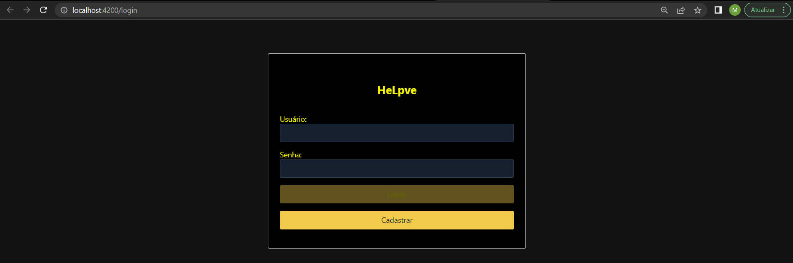
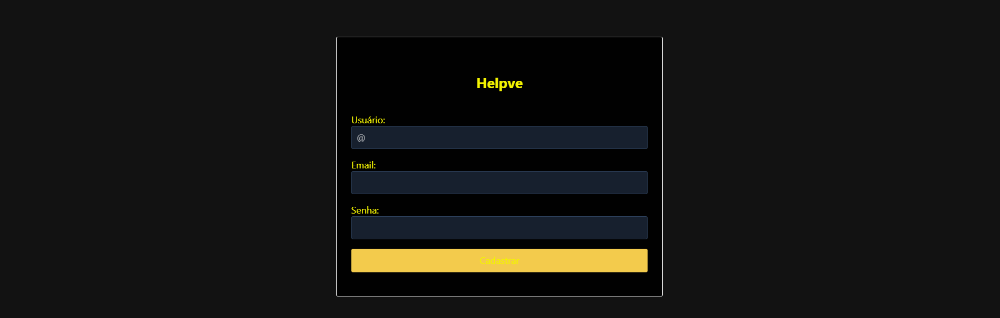
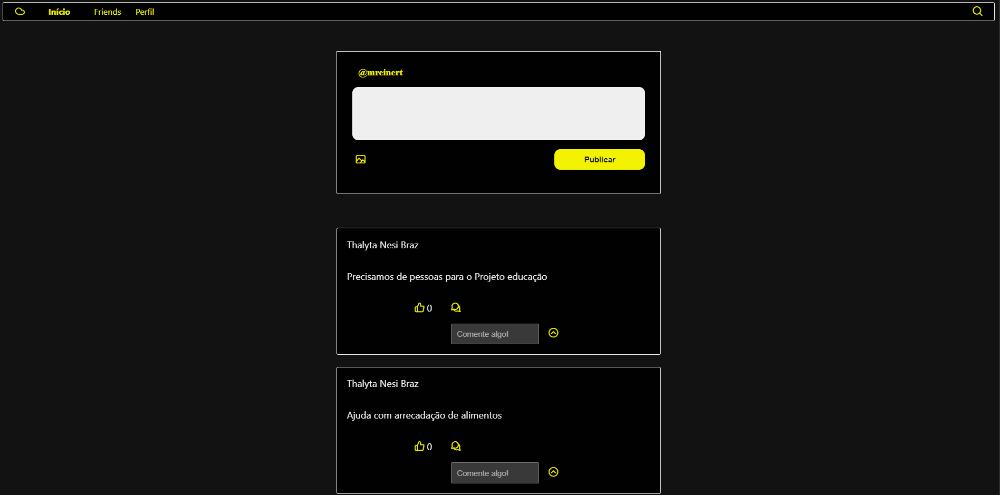
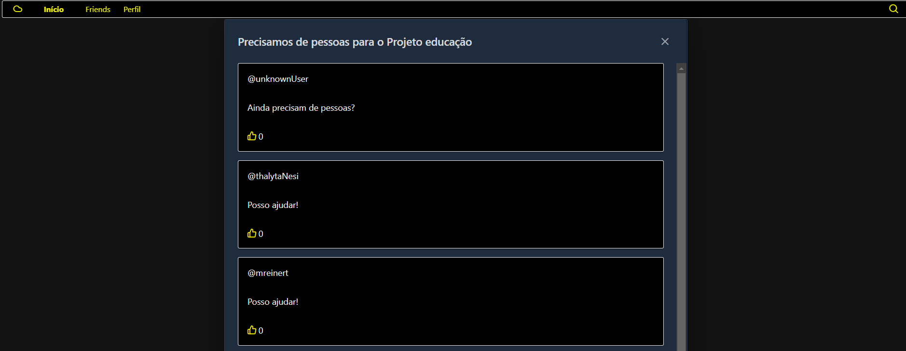
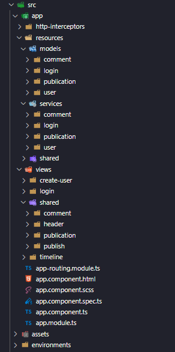

# Front-end criado apenas como validação do Back-end

# Rede social para a comunidade

----

O projeto possui o Objetivo de conectar pessoas que querem ajudar e entidades que precisam dessa ajuda ou pessoas com iniciativa de tornar a vida de outros um pouco melhor, de forma tal que ações podem ser publicadas tanto para divulgação de projetos que irão acontecer, como para mostrar ações que já foram desenvolvidas.

# Funcionalidades do projeto

---

O projeto possui as seguintes funcionalidades:

* Login: O login é feito com email e senha, o token e usuário retornado do back-end é armazenado no localStorage.
* Criação de usuários.
* Criação de comentários.

# Tecnologia utilizada

---

O projeto utiliza o framework angular na versão 12.

# Telas

Login 

Cadastrar

Timeline

Comentarios 

# Estrutura de pastas

----

## Development server

Run `ng serve` for a dev server. Navigate to `http://localhost:4200/`. The application will automatically reload if you change any of the source files.

